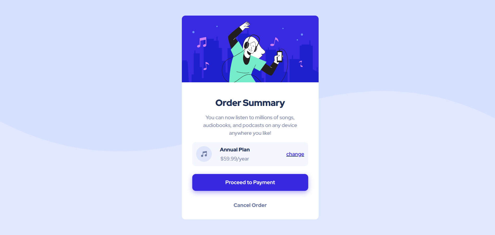

# Order Summary Component

A responsive order summary component built as part of the Frontend Mentor challenges. This project demonstrates modern CSS techniques and responsive design principles.

## Overview

### The Challenge

Users should be able to:
- View the optimal layout depending on their device's screen size
- See hover states for interactive elements
- Understand the order summary at a glance
- Change their subscription plan if needed

### Screenshots

| Desktop View | Mobile View |
|--------------|-------------|
|  |  |

### Links

- [Live Demo](https://saharzakersoltani.github.io/order-summary-component-main/)
- [Solution URL](https://github.com/saharzakersoltani/order-summary-component-main)
- [Challenge URL](https://www.frontendmentor.io/challenges/order-summary-component-QlPmajDUj)

## My Process

### Built With

- Semantic HTML5 markup
- CSS3 custom properties
- Flexbox
- Mobile-first workflow
- Responsive design principles
- CSS transitions for interactive elements

## Author

- **Sahar Zaker Soltani**
  - GitHub: [saharzakersoltani](https://github.com/saharzakersoltani)
  - Frontend Mentor: [@saharzakersoltani](https://www.frontendmentor.io/profile/saharzakersoltani)
  - Email: [sahar.zs2002.com](mailto:your-email@example.com)

## Acknowledgments

I would like to thank [Frontend Mentor](https://www.frontendmentor.io) for providing this challenge. It was a great opportunity to practice and improve my frontend development skills. Special thanks to the community for their support and feedback!

